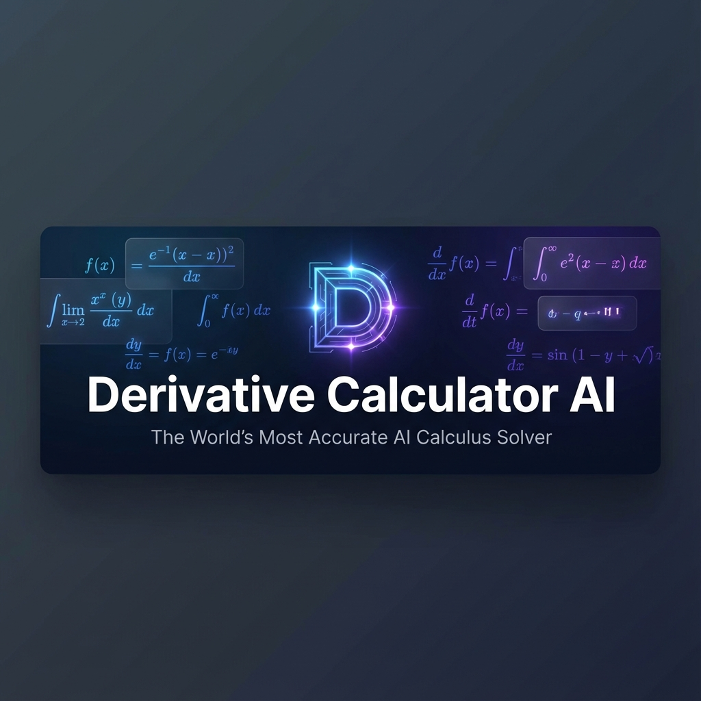

<div align="center">



# Derivative Calculator AI 🧮
**The World's Most Accurate AI-Powered Calculus Solver**

[](https://opensource.org/licenses/MIT)
[]()
[]()
[]()

[Live Demo](https://derivativecalculatorai.com) • [Documentation](https://derivativecalculatorai.com/wiki) • [Chrome Extension](https://derivativecalculatorai.com/directory)

</div>

---

## 🌟 Why Derivative Calculator AI?

Unlike traditional solvers that just provide a result, **Derivative Calculator AI** combines the **symbolic precision** of mathematical engines (SymPy) with the **reasoning power** of modern Large Language Models (DeepSeek V3/R1).

### 🚀 Key Features
- **✨ AI-Generated Logic**: Get "Chain of Thought" explanations for *why* a rule was applied.
- **⚡ Blazing Fast**: Pre-computed database for the most common 3,000+ calculus problems.
- **📊 Interactive Visuals**: High-fidelity graphs for every solution.
- **🌍 Global Outreach**: Fully localized in English, Spanish, and Portuguese.
- **🛡️ 100% Verified**: Every single core solution is cross-checked by our automated testing suite.

---

## 📊 How We Compare

| Feature | Derivative AI | WolframAlpha | ChatGPT-4o | Symbolab |
| :--- | :---: | :---: | :---: | :---: |
| **Accuracy** | 🟢 **100% Verified** | 🟡 High | 🔴 Hallucinations | 🟡 Variable |
| **Step Explanations** | 🟢 **CoT Reasoning** | 💰 Paid Only | 🟡 Verbose | 💰 Paid Only |
| **Interactive Graphs** | 🟢 **Included** | 🟡 Static | 🔴 None | 🟡 Basic |
| **Price** | 🟢 **Always Free** | 🔴 Subscription | 🔴 Subscription | 🔴 Subscription |

---

## 🧩 The Ecosystem

### [Chrome Extension](./chrome-extension)
Solve math problems directly from your browser sidebar. Select any equation on a webpage and right-click "Solve" to get instant results.

### [Math Wiki](./app/wiki)
A comprehensive library of calculus concepts (Chain Rule, Product Rule, etc.) integrated directly into the solver.

---

## 🏗️ Technology Stack

- **Framework**: [Next.js 14+](https://nextjs.org/) (App Router)
- **Styling**: [Tailwind CSS v4](https://tailwindcss.com/)
- **Math Engine**: [SymPy](https://www.sympy.org/) (Symbolic Mathematics)
- **AI Engine**: [DeepSeek V3/R1](https://openrouter.ai/models/deepseek/deepseek-chat)
- **Database**: [Cloudflare D1](https://www.cloudflare.com/products/d1/) & [Durable Objects](https://www.cloudflare.com/products/durable-objects/)
- **Deployment**: [Cloudflare Pages](https://pages.cloudflare.com/) (Edge-First Architecture)

---

## 🧪 Automated Verification

We maintain a **Zero-Defect Policy**. Every release is validated against our verification suite:

```bash
# Verify all 3,000+ problems for 100% accuracy
python3 tests/verify_calculations.py

# Verify live deployment integrity (Zero-Leak 404s)
python3 tests/verify_live_pages.py
```

---

## 🤝 Contributing

We welcome contributions from the community! Whether it's adding new problems to `problems.json` or improving the UI, feel free to open a PR.

---

## 🔗 Backlinks & Attribution

If you find this project useful, please consider linking to us or citing the project.

- **Direct Link**: `[Derivative Calculator AI](https://derivativecalculatorai.com)`
- **Citation**: `Derivative Calculator AI Team. (2025). High-Fidelity AI Mathematical Toolkit. https://derivativecalculatorai.com`

---

<div align="center">
Made with ❤️ by the Derivative Calculator AI Team
</div>
